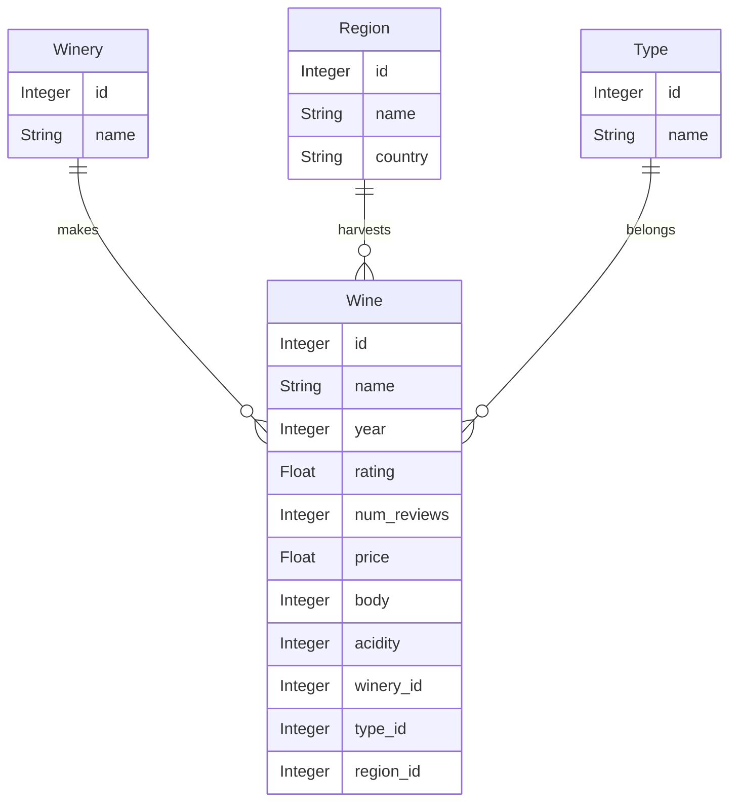

# Wine shop

* Normalize the given dataset wines_SPA.csv

* Build a RESTful API around the model implementing entity lists and all CRUD operations implementing the attached [OpenAPI specification](api-docs.yaml).

    * `/api/wine/{id}`
    * `/api/winery/{id}`
    * `/api/region/{id}`
    * `/api/type/{id}`

* Create unit tests.

* Create functional tests.

* Implement basic authentication.

(Data attribution: [fedesoriano](https://www.kaggle.com/fedesoriano))
